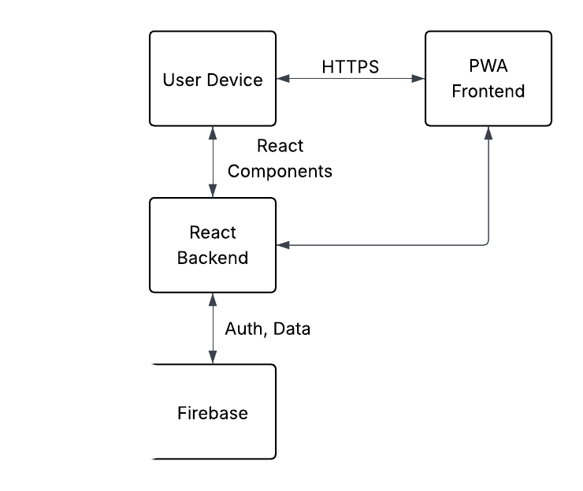

# Welcome to the HFB PWA!
Made with <3 by Adil Sheeth as a Software Engineering Major Work.

## Installation
To run this project, clone the repository locally and run the following commands:

```bash
npm install
npm start
```
To login, you may choose to create an account, or use the provided dummy account:

```
email: dummy@gmail.com
password: password1!
```

To access the admin panel (which is currently *unsecured*), navigate to the suburl `/admin`.


## Component A
Project Documentation

### Identifying and Defining

#### Needs and Opportunities
The needs and opportunities of this project were identified through discussions with stakeholders and potential users. The goal was to create a Progressive Web App (PWA) that provides a seamless user experience across devices.
| # |Need| Opportunities|
|---|---|---|
| 1 | Customers need a faster, easier way to order and pay for baby equipment hire services | Develop a modern, mobile-friendly PWA that simplifies the booking and payment process           |
| 2 | Customers need transparency on pricing, availability, and services  | Add features like real-time availability, clear pricing, and service area coverage              |
| 3 | Franchisees need a better system to manage bookings and communicate with customers | Integrate backend tools for franchisees to view, manage, and confirm bookings                   |
| 4 | The current website is dated and may not be optimised for mobile users | Build a Progressive Web App (PWA) that works offline, loads fast, and can be installed on mobile devices |
| 5 | Travellers and new parents need fast, reliable access to equipment without carrying it with them | Enable location-aware features, booking ahead for travel dates, and optional delivery/pick-up scheduling |
| 6 | Client requires a straightforward, responsive mobile focused system | Improve UX with a smooth, intuitive interface and mobile-first design |

#### Scheduling and Financial Feasibility

The scheduling and financial feasibility of the project was assessed by evaluating the resources available, including time, budget, and technical expertise. The project was given the following constraints:

The solution must be a mobile friendly interface which enables customers to hire baby equipment quickly and easily. It should allow users to view product options, confirm availability, and make secure payments. It must be optimised to be fast and responsive. Franchisees should be able to view and manage bookings through an admin dashboard. The system must support a minimal, clean design, and scale across Australia.

#### Generating requirements including functionality and performance

The requirements for the HFB PWA were generated based on user stories, stakeholder interviews, and analysis of similar platforms. Key functional and performance requirements include:

**Functional Requirements:**
- Users can browse available baby equipment with images, descriptions, and pricing.
- Real-time availability checking for products.
- Secure user authentication and account management.
- Booking system with date selection, payment integration, and booking confirmation.
- Admin dashboard for franchisees to manage bookings, update product listings, and view analytics.
- Push notifications for booking updates and reminders.
- Mobile-first, responsive design with offline support (PWA features).

**Performance Requirements:**
- Fast load times (under 2 seconds on modern devices).
- Reliable offline access for core features.
- Secure handling of user data and payments.
- Scalable backend to support growth in users and bookings.

These requirements guided the technical design and implementation choices throughout the project.


#### Defining data structures and data types

The following data structures and types were defined to support the functionality of the PWA:

- User: Represents a customer or franchisee using the system.
- Product: Represents a baby equipment item available for hire.
- Booking: Represents a customer's booking of a product, including details like dates, times, and payment status.
- AdminDashboard: Represents the interface for franchisees to manage bookings and view analytics.

#### Defining Boundaries

The boundaries of the project were established to ensure a clear focus on the core functionality of the PWA while avoiding unnecessary complexity. The following boundaries were defined:

Within scope:
- UI/UX and development of the PWA
- Order placement, booking management
- Basic admin dashboard

Out of scope:
- Physical delivery and pickup of equipment
- In-person installation of car seats
- Managing or supplying warehouses
- Other franchise matters (payroll, logistics, etc)

#### Tools Used
- Node.js for backend development
- React for frontend development
- Firebase for real-time database and authentication
- Stripe for payment processing

Installation and setup instructions are provided in the main README file.

Maintenance and updates will be handled through regular commits to the repository, with a focus on improving performance, adding features, and addressing user feedback.

### Research and Planning
Gantt Chart for the project timeline:


The only collaborator on this project is me, who has been responsible for all aspects of the development, including design, coding, testing, and deployment. Thus, only Github was used for version control, not so much for collaboration (but it is very possible!).

#### Communication Issues

I was in constant communication with the client, who was very involved in the process. I provided regular updates and sought feedback on design and functionality. The client was responsive and provided valuable input, which helped shape the final product. Whilst there were no major communication issues, there were some challenges in aligning expectations on certain features. However, these were resolved through open discussions and adjustments to the project scope, including the removal of some features that were not essential to the core functionality of the PWA, like payment integration and full admin dashboard features.

#### Quality Assurance

This project underwent rigorous testing to ensure quality and reliability. The following testing methods were employed:
- Unit testing for individual components and functions
- Integration testing to ensure components work together as expected
- User acceptance testing with the client to validate functionality and usability
- Performance testing to ensure fast load times and responsiveness
- Cross-browser testing to ensure compatibility across major browsers

Additionally, the project was ensured to be compliant with all relevant legislation. 

#### Modelling Tools
Data flow diagrams were used to model the system architecture and data structures. This diagram helped visualize the relationships between different components and ensured a clear understanding of the system's functionality.



Flowcharts were used to outline the flow of data and processes within the PWA. These charts provided a clear overview of how users interact with the system and how data is processed, from product selection to booking confirmation.


Class Diagrams and Decision Trees were not used in this project, as the focus was on a functional PWA rather than a complex object-oriented design. The data structures were simple enough to be represented without the need for detailed class diagrams.

A structure chart was not created for this project as the project was structured in a modular way, with clear separation of concerns between the frontend and backend components. The codebase follows best practices for maintainability and scalability, with components organized into directories based on functionality. 

## Component B
Complete Software Solution

### Producing and Implementing
The HFB PWA was developed using a combination of modern web technologies, including React for the frontend, Node.js for the backend, and Firebase for real-time database and authentication. The project was structured to ensure modularity and maintainability, with clear separation of concerns between the frontend and backend components.

Appropriate algorithm design was employed to handle key functionalities such as product availability checking, booking management, and payment processing. The algorithms were designed to be efficient and scalable, ensuring that the PWA can handle a growing number of users and bookings without performance degradation.

Version control was managed using Git, with regular commits to the repository to track changes and ensure a clear history of development. The project was deployed using Firebase Hosting, which provides a fast and reliable platform for serving the PWA. Github also hosts the project's process diary through commits, and logs of changes that have occurred.

### Testing and Evaluating
The project underwent extensive testing to ensure functionality, performance, and usability. The following testing methods were employed:
- Unit testing for individual components and functions
- Integration testing to ensure components work together as expected
- User acceptance testing with the client to validate functionality and usability
- Performance testing to ensure fast load times and responsiveness
- Cross-browser testing to ensure compatibility across major browsers

Lighthouse was used to test the accessibility, and page load testing. Additionally, testing was conducted on different devices, in order to ensure that the solution was cross-compatible and effective.

Feedback from the client was considered throughout the development cycle, including:
- Ditching the payment system
- Creating a better sign up system, including google maps integration
- Creating an admin panel with the ability to change the status of an order.

Code in JavaScript was optimised for performance, with a focus on reducing load times and ensuring a smooth user experience. The PWA was designed to be responsive and mobile-friendly, with a clean and intuitive interface that allows users to easily browse products, make bookings, and manage their accounts.


## Component C
Presentation is attached to the Google Classroom submission.
